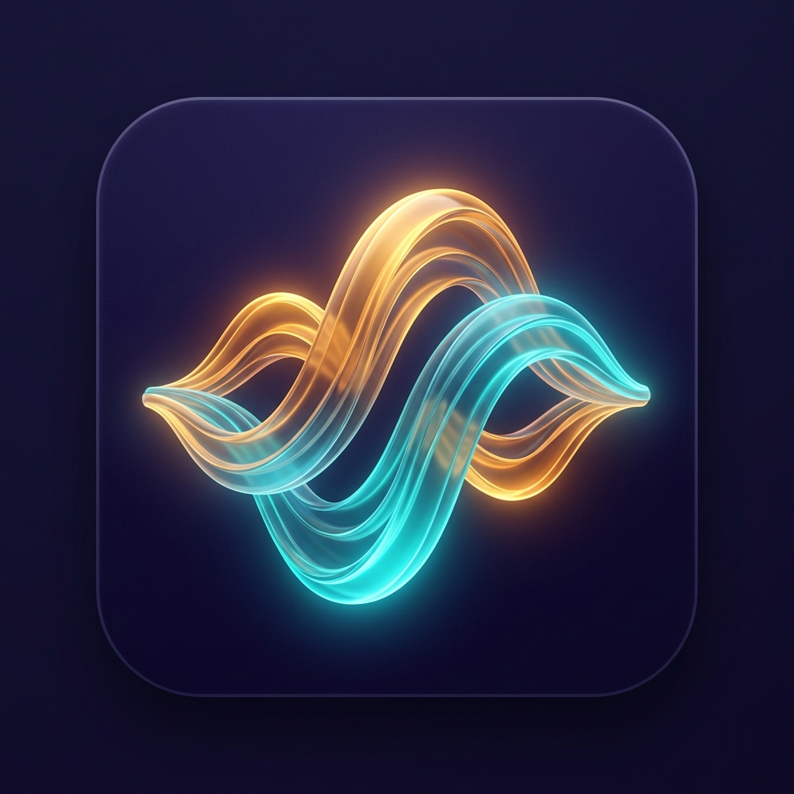
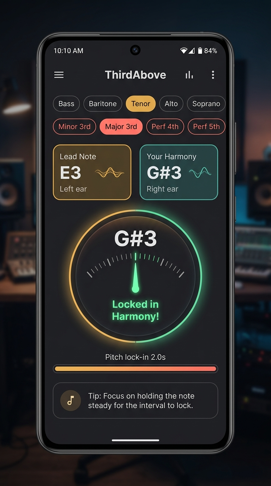

# ThirdAbove 🎵

> *Find your harmony. Master the art of vocal duet.*

**ThirdAbove** is a native Android vocal harmony trainer designed to help singers master two-part harmonies (such as 3rds, 4ths, 5ths, and 6ths) alongside a lead voice without getting magnetically pulled into singing the melody. Using real-time monophonic pitch tracking (YIN algorithm) and binaural stereo spatial separation (lead voice in the left ear, target harmony in the right ear), ThirdAbove trains your ear and voice to lock into resonant intervals with precision and confidence.

📖 **New to ThirdAbove? Check out the [Complete User Guide](USER_GUIDE.md)** for step-by-step setup, headphone recommendations, vocal range configurations, and duet practice strategies.

---

## 📱 App Icon & Screenshots

  

  
  &nbsp;&nbsp;&nbsp;&nbsp;
  

---

## ✨ Key Features

- **🎧 Stereo Spatial Ear Separation:** Panning the **Lead Note to the Left Ear** and **Your Harmony Target to the Right Ear** prevents acoustic masking in your head, allowing your ear to isolate and lock into harmony effortlessly.
- **🎤 Zero-Feedback Mic Gating:** The microphone stream is automatically muted while reference tones are sounding, preventing false readings from device speakers.
- **🎙️ Vocal Range Presets (Tenor, Baritone, Bass, Alto, Soprano):** Tailors melody roots to your vocal register. Tenor mode anchors harmonies in the resonant **G#3 to C#4** sweet spot, so you never have to strain for high A4s.
- **⚡ 2-Second Pitch Lock-In Progression:** Hold your pitch steady within tune (±25 cents) for 2 seconds to master the interval; the app automatically advances to the next melody note.
- **🔄 Smart 2-Second Duet Re-orientation:** If you struggle out of tune for 2 consecutive seconds, the app automatically replays both notes in stereo duet for 2 seconds to re-ground your pitch memory.
- **🚫 Anti-Lead Magnetic Pull Diagnostics:** Instantly alerts you if you accidentally slip into singing the melody note instead of the harmony note (*"Pulled to lead! Sing higher!"*).
- **🔬 YIN Monophonic Pitch Extraction:** Robust vocal fundamental frequency detection (80 Hz to 1200 Hz) with sub-sample parabolic interpolation.

---

## 🚀 Quick Download & Installation

### Option 1: Direct APK Download
1. Head to the **[Releases](https://github.com/JPTranter/ThirdAbove/releases)** tab on your Android phone.
2. Download `app-debug.apk`.
3. Open the file to install **ThirdAbove**.

### Option 2: Zero-Install Instant Web & iOS App
Sing right away in your browser or install on your iPhone / iPad / PC:
- 🌐 **Live Web App:** **[https://jptranter.github.io/ThirdAbove/](https://jptranter.github.io/ThirdAbove/)**
- 📱 **Install on iPhone:** Open the link in Safari, tap the **Share button** (square with arrow), then select **"Add to Home Screen"** to install it as a full-screen native-like app with the custom ThirdAbove icon!

---

## 📚 Documentation
- 📘 **[User Guide (USER_GUIDE.md)](USER_GUIDE.md):** Detailed walkthrough, headphone setup, interval guide, and duet strategies.
- 🛠️ **[Lessons Learnt (LESSONS_LEARNT.md)](LESSONS_LEARNT.md):** Audio DSP insights, psychoacoustic findings, and Android Gradle/JVM troubleshooting.

---

## 🛠️ Tech Stack & Architecture
- **Language:** Kotlin 2.0
- **UI Framework:** Jetpack Compose with Material 3
- **Audio Synthesis:** Low-latency stereo `AudioTrack` (PCM 16-bit, 44.1kHz)
- **Audio Input:** `AudioRecord` background stream with RMS noise gate
- **Security:** Pre-commit & CI secret protection powered by **Gitleaks**
- **CI/CD:** Automated GitHub Actions APK build and release pipeline

---

## 📄 License

This project is licensed under the [MIT License](LICENSE) © 2026 Jason Tranter.

